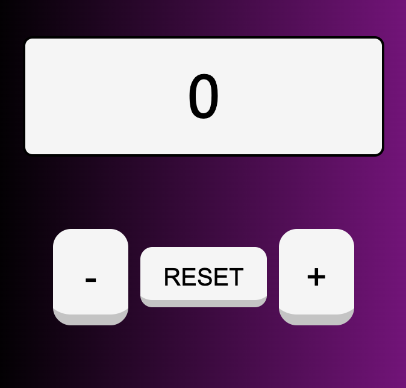

<!-- PROJECT INTRO -->
 

  <h1 align="center">COUNT WITH ME</h1>
  
JavaScript Basic Project

 

<!-- PROJECT IMAGE -->

  

 
 

## PRESENTATION

Welcome to my repository,

A little introduction about me... my name is <em>Plescan Andrei Leonard</em> and I am studying to become a `web developer`.  
I am currently taking the `"Full Stack Developer"` course on Start2Impact and this project is really about the languages learned so far.

## QUICK START

This is a simple counter developed with JavaScript where inside you can play by incrementing and decrementing the value within the display. 
The color of the values changes according to the number greater than or equal to 0, so blue, and less than or equal to 0, so red.  
If you want to restart from zero just press the "reset" button .

 

## GOALS 

Main goals to achieved in this project:

<ul>
  <li>Creation of the display and buttons using JavaScript</li>
  <li>Correct implementation of counter operation</li>
  <li>[OPTIONAL] Adding elements that can charaterize the counter, example, value color change, dynamic and responsive buttons.</li>
</ul>

 

## COUNTER FUNCTION 

Simple function where inside we identify the main value ( i = 0 ).
For each button we use the addEventListener method and call them with their assigned const.
Inside each function we have the following code blocks that must be executed whenever the user clicks on the buttons.
With the (innerHTML = i) method, the value inside the display changes based on which button is clicked.

 

## BUILT WITH

Languages used for counter creation:

  
  
  

 

## GUIDE 

No specific requirements, simply an internet connection and a few minutes to play with the counter.
HAVE FUN!!!  
Below is the link where you can access the site.
 
https://64f2362eafced019f1b53c79--effulgent-dodol-8511fe.netlify.app/

### BROWSER SUPPORT

 |  |  |  | 
